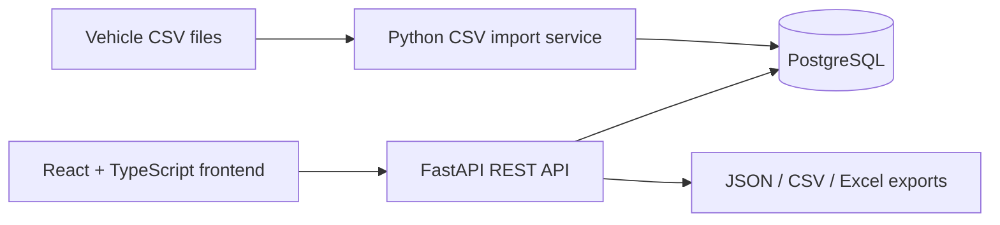

# Volteras SWE Challenge — EV Vehicle Data Application

This repository contains a small, production-shaped application for importing, querying, visualising and exporting EV telemetry data.

The application includes:

* A FastAPI REST API
* PostgreSQL persistence through SQLAlchemy
* CSV data import with validation and duplicate handling
* Server-side filtering, sorting and pagination
* JSON, CSV and Excel exports
* A React and TypeScript frontend
* Vehicle telemetry charts
* Automated backend tests with pytest
* Docker Compose for local development

## Architecture



## Technology stack

### Backend

* Python
* FastAPI
* SQLAlchemy 2
* Pydantic
* PostgreSQL
* openpyxl

### Frontend

* React
* TypeScript
* Vite
* TanStack React Query
* Recharts

### Testing and local development

* pytest
* pytest-cov
* FastAPI TestClient
* Docker
* Docker Compose
* Make

## Features

### CSV ingestion

Vehicle telemetry can be loaded from CSV files stored in `sample_data/`.

The filename is used as the vehicle ID:

```text
<vehicle_id>.csv
```

For example:

```text
06ab31a9-b35d-4e47-8e44-9c35feb1bfae.csv
```

The CSV importer:

* Validates that all required columns are present
* Converts ISO timestamps into Python datetimes
* Supports timestamps ending in `Z`
* Converts recognised null values into `None`
* Allows nullable `speed` and `shift_state` values
* Requires `odometer`, `soc` and `elevation`
* Reports the CSV row number when validation fails
* Skips existing rows with the same `(vehicle_id, timestamp)`
* Returns inserted and skipped row counts

Recognised null values include:

```text
""
NULL
NONE
N/A
```

### Vehicle-data API

The API supports:

* Filtering by vehicle ID
* Optional start and end timestamp filters
* Server-side pagination
* Server-side sorting
* Allow-listed sort columns
* Ascending and descending ordering
* Single-row retrieval
* Validation errors for invalid query parameters

### Data export

All records for a vehicle can be downloaded in:

* JSON
* CSV
* Excel `.xlsx`

Export filenames are sanitised before being returned to the browser.

### React frontend

The frontend provides:

* Vehicle ID filtering
* Start and end timestamp filtering
* Loading and error states
* Server-side table pagination
* Configurable page sizes
* Server-side column sorting
* JSON, CSV and Excel download controls
* A telemetry line chart
* A selectable chart field

The chart can display:

* Speed
* Odometer
* State of charge
* Elevation

The chart currently displays the records returned for the active table page.

## Repository structure

```text
.
├── ai_usage
│   └── prompts.md
├── backend
│   ├── app
│   │   ├── api
│   │   ├── core
│   │   ├── db
│   │   ├── models
│   │   ├── schemas
│   │   └── services
│   ├── scripts
│   └── tests
├── frontend
│   ├── src
│   │   ├── api
│   │   ├── components
│   │   └── types
├── sample_data
├── docker-compose.yml
├── Makefile
└── README.md
```

## Quick start

Copy the example environment file:

```bash
cp .env.example .env
```

The env file should look like as follows:

```
POSTGRES_DB=<database_name>
POSTGRES_USER=<database_user>
POSTGRES_PASSWORD=<database_password>

DATABASE_URL=postgresql+psycopg://<database_user>:<database_password>@db:5432/<database_name>

VITE_API_BASE_URL=http://localhost:8000
```

where VITE_API_BASE_URL tells the React frontend where the FastAPI backend is running.


Build and start the application:

```bash
docker compose up --build
```

Then open:

* Frontend: `http://localhost:5173`
* API documentation: `http://localhost:8000/docs`

The backend creates the required database tables when the application starts.

## Load the supplied CSV data

Place the CSV files in:

```text
sample_data/
```

Keep the following filename format:

```text
<vehicle_id>.csv
```

Then run:

```bash
make import-data
```

Equivalent Docker Compose command:

```bash
docker compose run --rm backend \
  python -m scripts.load_csv /data
```

The loader is idempotent for rows sharing the same:

```text
(vehicle_id, timestamp)
```

Re-running the import will skip records already stored in the database.

## API endpoints

### List vehicle data

```http
GET /api/v1/vehicle_data/
```

Example:

```http
GET /api/v1/vehicle_data/?vehicle_id=vehicle-001&start_timestamp=2026-01-01T00:00:00Z&end_timestamp=2026-01-02T00:00:00Z&page=1&page_size=50&sort_by=timestamp&sort_order=desc
```

Supported query parameters:

| Parameter         | Required | Description                                |
| ----------------- | -------: | ------------------------------------------ |
| `vehicle_id`      |      Yes | Vehicle whose telemetry should be returned |
| `start_timestamp` |       No | Inclusive lower timestamp boundary         |
| `end_timestamp`   |       No | Inclusive upper timestamp boundary         |
| `page`            |       No | Page number, starting from 1               |
| `page_size`       |       No | Number of rows, between 1 and 500          |
| `sort_by`         |       No | Allow-listed field used for ordering       |
| `sort_order`      |       No | `asc` or `desc`                            |

Example response:

```json
{
  "items": [
    {
      "id": 1,
      "vehicle_id": "vehicle-001",
      "timestamp": "2026-01-01T12:00:00Z",
      "speed": 42.5,
      "odometer": 12001.4,
      "soc": 81.2,
      "elevation": 34.8,
      "shift_state": "D"
    }
  ],
  "page": 1,
  "page_size": 50,
  "total": 1,
  "pages": 1
}
```

### Retrieve one row

```http
GET /api/v1/vehicle_data/{row_id}/
```

Example:

```http
GET /api/v1/vehicle_data/123/
```

A missing row returns:

```json
{
  "detail": "Vehicle data row not found"
}
```

with HTTP status `404`.

### Import a CSV through the API

```http
POST /api/v1/vehicle_data/import?vehicle_id=vehicle-001
Content-Type: multipart/form-data
```

Example with `curl`:

```bash
curl -X POST \
  "http://localhost:8000/api/v1/vehicle_data/import?vehicle_id=vehicle-001" \
  -F "file=@sample_data/vehicle-001.csv"
```

Example response:

```json
{
  "inserted": 100,
  "skipped": 5
}
```

Only files with a `.csv` extension are accepted.

### Export vehicle data

```http
GET /api/v1/vehicle_data/{vehicle_id}/export?format={format}
```

Supported formats:

```text
json
csv
xlsx
```

Examples:

```http
GET /api/v1/vehicle_data/vehicle-001/export?format=json
```

```http
GET /api/v1/vehicle_data/vehicle-001/export?format=csv
```

```http
GET /api/v1/vehicle_data/vehicle-001/export?format=xlsx
```

Example browser URLs:

```text
http://localhost:8000/api/v1/vehicle_data/vehicle-001/export?format=csv
```

```text
http://localhost:8000/api/v1/vehicle_data/vehicle-001/export?format=xlsx
```

The response includes a `Content-Disposition` header so that the browser downloads the generated file.

## Running tests

Run all backend tests:

```bash
make test
```

Equivalent command:

```bash
docker compose run --rm backend pytest -q
```

Run with coverage:

```bash
make coverage
```

Equivalent command:

```bash
docker compose run --rm backend \
  pytest \
  --cov=app \
  --cov-branch \
  --cov-report=term-missing \
  --cov-report=html
```

The HTML coverage report is generated in:

```text
backend/htmlcov/index.html
```

Open it on macOS with:

```bash
open backend/htmlcov/index.html
```

The test suite covers:

* CSV null handling
* Required numeric fields
* Missing CSV columns
* Invalid timestamps
* Invalid numeric values
* CSV row-number error reporting
* Duplicate import handling
* Database-session cleanup
* Pagination metadata
* Timestamp filtering
* Sort parameter validation
* Missing vehicle-data rows
* JSON, CSV and Excel generation
* Export download headers
* Invalid file uploads
* Health and CORS behaviour

## Makefile commands

```bash
make up
```

Build and start all services.

```bash
make down
```

Stop the services.

```bash
make logs
```

Follow Docker Compose logs.

```bash
make import-data
```

Import the CSV files in `sample_data/`.

```bash
make test
```

Run the backend test suite.

```bash
make coverage
```

Run tests with coverage reporting.

```bash
make lint
```

Run backend linting.

## Data model

Each vehicle-data row contains:

| Field         | Type      | Nullable |
| ------------- | --------- | -------: |
| `id`          | Integer   |       No |
| `vehicle_id`  | String    |       No |
| `timestamp`   | Timestamp |       No |
| `speed`       | Float     |      Yes |
| `odometer`    | Float     |       No |
| `soc`         | Float     |       No |
| `elevation`   | Float     |       No |
| `shift_state` | String    |      Yes |

The combination of:

```text
vehicle_id + timestamp
```

is treated as the logical uniqueness boundary for imported telemetry.

This allows data from different vehicles to have records at the same timestamp while preventing the same observation from being imported repeatedly for one vehicle.

## Design decisions

### Database-driven pagination and sorting

Pagination, filtering and sorting are performed by PostgreSQL instead of loading the complete dataset into the browser.

This:

* Reduces API response size
* Avoids unnecessary frontend memory use
* Scales better as the table grows
* Keeps ordering consistent between pages

### Allow-listed sort columns

The API maps accepted sort names onto known SQLAlchemy columns.

This prevents clients from supplying arbitrary database expressions and makes supported ordering behaviour explicit.

### Separate database and API models

SQLAlchemy models represent persisted database entities.

Pydantic schemas represent validated API input and output.

Keeping them separate avoids tightly coupling the public API contract to the database implementation.

### Nullable telemetry

`speed` and `shift_state` are nullable because telemetry may be absent when a vehicle is stationary, switched off or unable to report a value.

Required measurements such as `odometer`, `soc` and `elevation` are rejected when empty.

### Import idempotency

Before inserting a row, the importer checks whether a record already exists for the same vehicle and timestamp.

This provides simple, understandable idempotency for the challenge dataset.

For significantly larger imports, this would be replaced with a database uniqueness constraint and a bulk insertion strategy.

## Current trade-offs and limitations

### Table creation

The current application uses SQLAlchemy metadata to create tables automatically.

For a production system, schema changes should be managed through a migration tool such as Alembic.

### CSV ingestion performance

Rows are currently validated and inserted individually.

For high-volume ingestion, improvements could include:

* PostgreSQL `COPY`
* Batched inserts
* Staging tables
* Database-level conflict handling
* Asynchronous ingestion jobs
* Background workers
* Import status tracking

### Chart pagination

The frontend chart uses the records from the current paginated table response.

As a result, changing table pages also changes the plotted data.

For a production analytics view, I would add a separate chart endpoint that returns an appropriately sampled or aggregated time series.

### Export size

Exports currently load all matching vehicle records into application memory before generating the file.

For large datasets, I would use streaming responses, chunked database reads or asynchronous export generation.

### Observability

A production implementation should add:

* Structured logging
* Request tracing
* Metrics
* Import error reporting
* Database query monitoring
* Health and readiness probes

## Scaling considerations

For substantially larger telemetry volumes, I would evaluate:

* Composite indexes on `vehicle_id` and `timestamp`
* Database uniqueness constraints
* Time-based table partitioning
* PostgreSQL bulk `COPY`
* Asynchronous ingestion
* Message queues
* Data-retention policies
* Downsampling and aggregation
* Read replicas
* Object storage for raw files
* A time-series database where justified by query volume and retention requirements

## AI usage

AI tooling was used for:

* Producing an initial repository scaffold
* Explaining unfamiliar React and TypeScript concepts
* Generating boilerplate pytest mocks and monkeypatch examples
* Suggesting debugging steps for Docker and npm problems

All generated output was reviewed, adapted and validated.

The meaningful prompts and how their output was used are documented in:

```text
ai_usage/prompts.md
```
