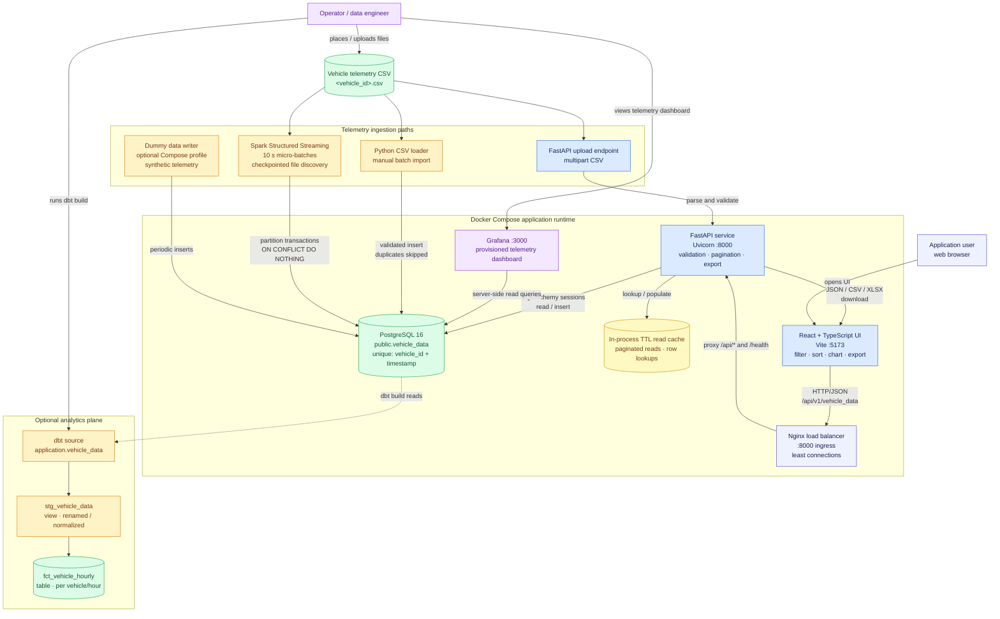

# Volteras vehicle telemetry system architecture

This document is the engineering reference for the system as it exists in this
repository. It distinguishes the always-on application path from the optional
batch, streaming, and analytics paths so that deployment and operational
dependencies are clear.

## System diagram

### Diagram legend

- **Indigo** components are users, browsers, or ingress points.
- **Blue** components serve the interactive application path.
- **Yellow** marks the short-lived in-process read cache.
- **Green** components are persisted data or data products.
- **Purple** components are operator-facing tools.
- **Amber** components are invoked ingestion or analytics workloads rather
  than required always-on services.
- Solid arrows are request, cache, or write flows. The dotted arrow is the analytical
  read dependency.

## Primary data flows

### Interactive query and export

1. The browser requests a vehicle and optional time range, page, and sort
   settings from the FastAPI API.
2. FastAPI validates the query, checks the short-lived read cache for common
   paginated or row lookups, and uses an SQLAlchemy session on a cache miss to
   count and retrieve the requested page from PostgreSQL.
3. The UI renders the returned page as both a table and a telemetry chart.
4. An export request reads all rows for one vehicle, orders them by timestamp,
   and returns a generated JSON, CSV, or Excel download.

### Batch and API ingestion

1. CSV filenames identify the vehicle as `<vehicle_id>.csv`; API uploads take
   the vehicle ID as a query parameter.
2. The Python importer validates the header and each typed telemetry field.
3. Rows are inserted into `public.vehicle_data`; records already present at
   the `(vehicle_id, timestamp)` grain are skipped.
4. Successful API imports clear the in-process API cache so imported records are
   visible immediately to subsequent API reads.

### Streaming and analytics

1. Spark discovers CSV files, parses and validates records, and processes them
   in micro-batches. Its checkpoint prevents already-seen files from being
   rediscovered after a normal restart.
2. Each non-empty Spark partition writes in one PostgreSQL transaction. The
   database uniqueness constraint is the final replay-safety boundary.
3. A separately invoked `dbt build` reads the application-owned source table,
   creates an analytics staging view, and materializes hourly vehicle metrics.

## Key engineering reference points

| Concern | Current design | Engineering implication |
| --- | --- | --- |
| System of record | PostgreSQL `public.vehicle_data` | API, loader, Spark, and dbt share one data contract; schema changes must be coordinated. |
| Record identity | Unique `(vehicle_id, timestamp)` | Batch retries and stream replays are idempotent, but two readings for the same vehicle and instant cannot coexist. |
| Startup order | Healthy PostgreSQL → FastAPI → load balancer → frontend | FastAPI currently creates the table at startup; Spark and dbt must wait until it exists. |
| Application boundary | Browser calls Nginx, which proxies FastAPI over HTTP; only FastAPI accesses application data | Keep database credentials out of the browser and preserve the API as the validation boundary. |
| Query behavior | Filtering, sorting, counting, and pagination run in PostgreSQL on cache misses | The composite vehicle/timestamp index supports the primary access pattern; the chart contains only the active page. The in-process cache is a local optimization, not a cross-replica consistency layer. |
| Validation | Pydantic/Python validates batch and API imports; Spark has a parallel validation implementation | Contract changes must be made in both ingestion paths to avoid inconsistent acceptance rules. |
| Stream delivery | Checkpointed file discovery plus conflict-safe database inserts | Delivery is effectively at-least-once with idempotent persistence, not exactly-once end to end. |
| Bad stream records | Invalid rows are counted in logs and discarded | A production design should use a durable dead-letter store with reason, source file, and batch metadata. |
| Analytics ownership | dbt reads the application table and writes the `analytics` schema | Run dbt with a separate least-privilege role and schedule it after the ingestion freshness window. |
| Availability | Nginx fronts the API service, with one PostgreSQL volume | This is still a local-development topology, without high availability, automated backups, or disaster recovery. Scale API replicas only with database connection budgets and cache staleness in mind. |
| Security | Local CORS origin and development credentials | Production needs managed secrets, TLS, authentication/authorization, restricted origins, and non-development servers. |
| Observability | Provisioned Grafana telemetry dashboard plus application/stream console logs and API docs | Grafana currently visualizes business telemetry directly from PostgreSQL; add application metrics, traces, ingestion freshness, rejection rates, and saturation alerts. |
| Schema lifecycle | SQLAlchemy `create_all` at API startup | Replace startup DDL with versioned migrations before multiple environments or rolling deployments. |
| Scaling constraint | Spark opens one transaction/connection per non-empty partition | Bound partitions and API pool sizes against PostgreSQL connection and write capacity. |

## Ownership and failure boundaries

- **Frontend failure:** querying and visualization are unavailable, while
  ingestion, stored data, and independently scheduled analytics can continue.
- **API failure:** browser reads, uploads, and exports stop; the external Spark
  writer can continue if PostgreSQL remains available.
- **PostgreSQL failure:** every read, write, and analytics path is blocked. This
  is the principal shared dependency and recovery priority.
- **Spark failure:** interactive use and manual/API imports continue. Restart
  with the same durable checkpoint to resume discovery.
- **dbt failure:** the application remains available, but analytics tables
  become stale until a successful rebuild.

## Production evolution priorities

1. Introduce versioned database migrations, managed PostgreSQL backups, and a
   restore test.
2. Add identity, authorization, TLS, managed secrets, and environment-specific
   CORS configuration at the application boundary.
3. Define a versioned telemetry contract shared by Python and Spark, and retain
   rejected records in a queryable dead-letter store.
4. Add service health/readiness checks, structured telemetry, service-level
   indicators, and alerts for latency, errors, freshness, and saturation.
5. Put the frontend behind a production web server or CDN, run replicated API
   instances behind a load balancer, and enforce database connection budgets.
6. Decouple higher-volume ingestion with durable object storage or a message
   broker when direct PostgreSQL partition writes no longer meet throughput and
   recovery objectives.
